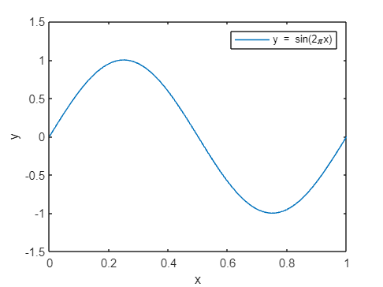
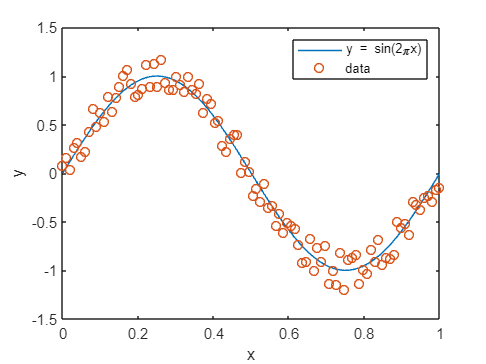
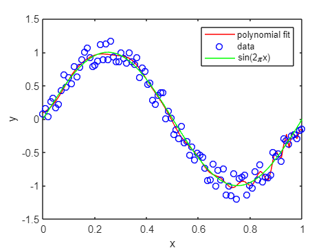
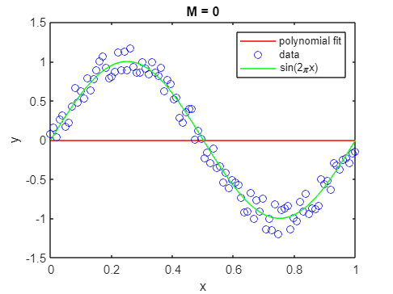
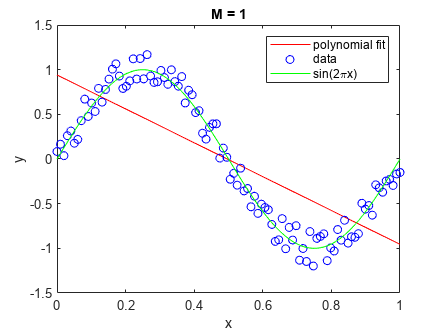
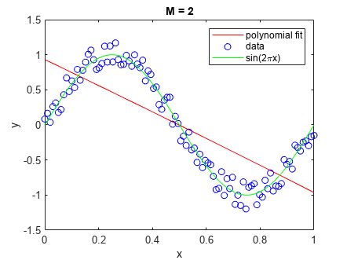
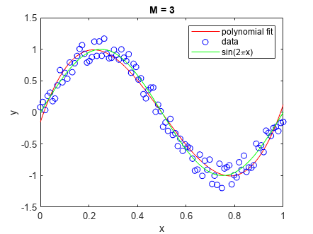
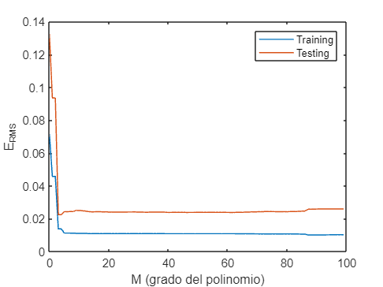

# Polynomial interpolation

Nel seguito di questo notebook verrà presentato un approccio alla base del ML: fitting polinomiale. Nello specifico verranno generati dei punti casualmente distribuiti attorno alla funzione seno e si otterà il polinomio interpolante (overfitting) che attraversa tutti i punti (di learning). In seguito si rappresenteranno polinomi aventi gradi inferiori a $n-1$ (dove $n$ rappresenta il numero di punti precedentemente generati) e si calcolerà lo scarto quadratico medio o root mean square error $E_{RMS}$ per ogni grado.

```matlab
% cleaning enviroment
clc
clear
```

Rappresento la funzione $y=sin(2\pi x)$ con $0\le x\le 1$

```matlab
% funzione seno
sen = @(x) sin(2*pi*x);

% genero vettori
x = linspace(0,1,100);
y = sen(x);
```

```matlab
% setto spessore linea
lw = 1;

% plotto funzione seno
figure;
plot(x,y,"LineWidth",lw)
xlabel("x")
ylabel("y")
legend("y = sin(2\pix)")
xlim([0 1])
ylim([-1.5 1.5])
```



Genero set di learning avente `n_lrn` punti randomicamente distribuiti attorno alla funzione seno

```matlab
% genero set di learning
n_lrn = 25;
x_lrn = linspace(0,1,n_lrn);
% rumore
eps = 0.2; 
y_lrn = sen(x_lrn) + rand_between(-eps,eps,n_lrn)';
```

```matlab
% rappresento punti
figure;
plot(x,y,"LineWidth",lw)
hold on
plot(x_lrn,y_lrn,"o","LineWidth",1)
legend("y = sin(2\pix)","data")
xlabel("x")
ylabel("y")
hold off
xlim([0 1])
ylim([-1.5 1.5])
```



Il **polinomio interpolante** è quel polinomio la cui curva passa attraverso tutti i punti sperimentali. Se il polinomio ha forma generale $y=a_1 +a_2 x+a_3 x^3 +...+a_n x^{n-1}$ dove 

   -  $n$ è il numero di punti da fittare; 
   -  $a_1$, $a_2$, ..., $a_n$ sono gli $n$ coefficienti del polinomio; 

Posto $\bar{x} =(x_1 ,x_2 ,...,x_n )$, affinchè il polinomio attraversi tutti i punti del vettore $\bar{x}$ deve verificare le seguenti condizioni:

   \item{ $y_1 =a_1 +a_2 x_1 +a_3 x_1^3 +...+a_n x_1^{n-1}$     (condizione passaggio per il punto $x_1$) }
   \item{ $y_2 =a_1 +a_2 x_2 +a_3 x_2^3 +...+a_n x_2^{n-1}$     (condizione passaggio per il punto $x_2$) }
   -  ... 
   \item{ $y_n =a_1 +a_2 x_n +a_3 x_n^3 +...+a_n x_n^{n-1}$     (condizione passaggio per il punto $x_n$) }

che rappresenta un sistema di $n$ equazioni in $n$ incognite. Il nostro obiettivo consiste nel risolvere il sistema per determinare gli $n$ coefficienti $a_1$, $a_2$, ..., $a_n$ e quindi il polinomio interpolante.

Sfruttando il formalismo matriciale è possibile rappresentare il sistema di $n$ equazioni come di seguito

$$
\left(\begin{array}{c}
y_1 \\
y_2 \\
...\\
y_n 
\end{array}\right)=\left(\begin{array}{ccccc}
1 & x_1  & x_1^2  & ... & x_1^{n-1} \\
1 & x_2  & x_2^2  & ... & x_2^{n-1} \\
... & ... & ... & ... & ...\\
1 & x_n  & x_n^2  & ... & x_n^{n-1} 
\end{array}\right)\cdot \left(\begin{array}{c}
a_1 \\
a_2 \\
...\\
a_n 
\end{array}\right)
$$

La matrice 

$$
V=\left(\begin{array}{ccccc}
1 & x_1  & x_1^2  & ... & x_1^{n-1} \\
1 & x_2  & x_2^2  & ... & x_2^{n-1} \\
... & ... & ... & ... & ...\\
1 & x_n  & x_n^2  & ... & x_n^{n-1} 
\end{array}\right)
$$

prende il nome "matrice di Vandermonde" e si genera elevando gli elementi del vettore $\bar{x}$  da 0 a $n-1$.

In MATLAB è possibile generare la matrice di Vandermonde utilizzando la funzione `vander()`

```matlab
% genero matrice di Vandermonde
V = fliplr(vander(x_lrn))
```

```text:Output
V = 100x100    
    1.0000         0         0         0         0         0         0         0         0         0         0         0         0         0         0         0         0         0         0         0         0         0         0         0         0         0         0         0         0         0         0         0         0         0         0         0         0         0         0         0         0         0         0         0         0         0         0         0         0         0
    1.0000    0.0101    0.0001    0.0000    0.0000    0.0000    0.0000    0.0000    0.0000    0.0000    0.0000    0.0000    0.0000    0.0000    0.0000    0.0000    0.0000    0.0000    0.0000    0.0000    0.0000    0.0000    0.0000    0.0000    0.0000    0.0000    0.0000    0.0000    0.0000    0.0000    0.0000    0.0000    0.0000    0.0000    0.0000    0.0000    0.0000    0.0000    0.0000    0.0000    0.0000    0.0000    0.0000    0.0000    0.0000    0.0000    0.0000    0.0000    0.0000    0.0000
    1.0000    0.0202    0.0004    0.0000    0.0000    0.0000    0.0000    0.0000    0.0000    0.0000    0.0000    0.0000    0.0000    0.0000    0.0000    0.0000    0.0000    0.0000    0.0000    0.0000    0.0000    0.0000    0.0000    0.0000    0.0000    0.0000    0.0000    0.0000    0.0000    0.0000    0.0000    0.0000    0.0000    0.0000    0.0000    0.0000    0.0000    0.0000    0.0000    0.0000    0.0000    0.0000    0.0000    0.0000    0.0000    0.0000    0.0000    0.0000    0.0000    0.0000
    1.0000    0.0303    0.0009    0.0000    0.0000    0.0000    0.0000    0.0000    0.0000    0.0000    0.0000    0.0000    0.0000    0.0000    0.0000    0.0000    0.0000    0.0000    0.0000    0.0000    0.0000    0.0000    0.0000    0.0000    0.0000    0.0000    0.0000    0.0000    0.0000    0.0000    0.0000    0.0000    0.0000    0.0000    0.0000    0.0000    0.0000    0.0000    0.0000    0.0000    0.0000    0.0000    0.0000    0.0000    0.0000    0.0000    0.0000    0.0000    0.0000    0.0000
    1.0000    0.0404    0.0016    0.0001    0.0000    0.0000    0.0000    0.0000    0.0000    0.0000    0.0000    0.0000    0.0000    0.0000    0.0000    0.0000    0.0000    0.0000    0.0000    0.0000    0.0000    0.0000    0.0000    0.0000    0.0000    0.0000    0.0000    0.0000    0.0000    0.0000    0.0000    0.0000    0.0000    0.0000    0.0000    0.0000    0.0000    0.0000    0.0000    0.0000    0.0000    0.0000    0.0000    0.0000    0.0000    0.0000    0.0000    0.0000    0.0000    0.0000
    1.0000    0.0505    0.0026    0.0001    0.0000    0.0000    0.0000    0.0000    0.0000    0.0000    0.0000    0.0000    0.0000    0.0000    0.0000    0.0000    0.0000    0.0000    0.0000    0.0000    0.0000    0.0000    0.0000    0.0000    0.0000    0.0000    0.0000    0.0000    0.0000    0.0000    0.0000    0.0000    0.0000    0.0000    0.0000    0.0000    0.0000    0.0000    0.0000    0.0000    0.0000    0.0000    0.0000    0.0000    0.0000    0.0000    0.0000    0.0000    0.0000    0.0000
    1.0000    0.0606    0.0037    0.0002    0.0000    0.0000    0.0000    0.0000    0.0000    0.0000    0.0000    0.0000    0.0000    0.0000    0.0000    0.0000    0.0000    0.0000    0.0000    0.0000    0.0000    0.0000    0.0000    0.0000    0.0000    0.0000    0.0000    0.0000    0.0000    0.0000    0.0000    0.0000    0.0000    0.0000    0.0000    0.0000    0.0000    0.0000    0.0000    0.0000    0.0000    0.0000    0.0000    0.0000    0.0000    0.0000    0.0000    0.0000    0.0000    0.0000
    1.0000    0.0707    0.0050    0.0004    0.0000    0.0000    0.0000    0.0000    0.0000    0.0000    0.0000    0.0000    0.0000    0.0000    0.0000    0.0000    0.0000    0.0000    0.0000    0.0000    0.0000    0.0000    0.0000    0.0000    0.0000    0.0000    0.0000    0.0000    0.0000    0.0000    0.0000    0.0000    0.0000    0.0000    0.0000    0.0000    0.0000    0.0000    0.0000    0.0000    0.0000    0.0000    0.0000    0.0000    0.0000    0.0000    0.0000    0.0000    0.0000    0.0000
    1.0000    0.0808    0.0065    0.0005    0.0000    0.0000    0.0000    0.0000    0.0000    0.0000    0.0000    0.0000    0.0000    0.0000    0.0000    0.0000    0.0000    0.0000    0.0000    0.0000    0.0000    0.0000    0.0000    0.0000    0.0000    0.0000    0.0000    0.0000    0.0000    0.0000    0.0000    0.0000    0.0000    0.0000    0.0000    0.0000    0.0000    0.0000    0.0000    0.0000    0.0000    0.0000    0.0000    0.0000    0.0000    0.0000    0.0000    0.0000    0.0000    0.0000
    1.0000    0.0909    0.0083    0.0008    0.0001    0.0000    0.0000    0.0000    0.0000    0.0000    0.0000    0.0000    0.0000    0.0000    0.0000    0.0000    0.0000    0.0000    0.0000    0.0000    0.0000    0.0000    0.0000    0.0000    0.0000    0.0000    0.0000    0.0000    0.0000    0.0000    0.0000    0.0000    0.0000    0.0000    0.0000    0.0000    0.0000    0.0000    0.0000    0.0000    0.0000    0.0000    0.0000    0.0000    0.0000    0.0000    0.0000    0.0000    0.0000    0.0000

```

Risolvo il sistema e determino i coefficienti $a_1$, $a_2$, ..., $a_n$ eseguendo il prodotto matriciale $V^{-1} \cdot \bar{y}$ in cui $\bar{y} =(y_1 ,y_2 ,...,y_n )$

Alla luce della forma matriciale, è possibile determinare i coefficienti $\alpha$ eseguendo il prodotto righe per colonna tra l'inversa della matrice di Vandermonde e il vettore colonna y.

In  MATLAB è possibile eseguire questa operazione sia sfruttando la funzione `pinv()` che determina la matrice pseudoinversa

```matlab
a = pinv(V)*(y_lrn')
```

```text:Output
a = 100x1    
1.0e+10 *

    0.0000
    0.0000
   -0.0000
    0.0000
   -0.0000
    0.0002
   -0.0029
    0.0276
   -0.1709
    0.6986

```

oppure utilizzando la sintassi `V\y_lrn'`

```matlab
% determino i coefficienti
% a = V\y_lrn'

% ottengo il polinomio funzione degli scalari x e m (grado)
% poly = @(x,m) (x.^(0:m))*(a(1:m+1));
```

Determiniamo i valori previsti

```matlab
% over-fitting
% determino le ordinate previste dal
% modello con poly_predict (funzione definita in basso)
% poly_predict(x,a,n_lrn-1)

% plotting predicted values
figure;
plot(x,poly_predict(x,a,n_lrn-1),"r","LineWidth",lw)
hold on
plot(x_lrn,y_lrn,'ob',"LineWidth",1)
plot(x,y,"g","LineWidth",lw)
hold off
legend("polynomial fit", "data", "sin(2\pix)")
xlabel("x")
ylabel("y")
ylim([-1.5 1.5])
xlim([0 1])
```



Cosa succede utilizzando polinomi di grado inferiore a $n-1$?

```matlab
% plotting at different M (polynomial order)
for m = 0:3

    % uso funzione vander personalizzata che permette di costruire matrici di
    % Vandermonde incomplete in funzione del grado m fornito
    V = custom_vander(x_lrn,m)
    a = pinv(V)*(y_lrn')
    
    figure;
    plot(x,poly_predict(x,a,m),"r")
    hold on
    plot(x_lrn,y_lrn,'ob')
    plot(x,y,"g")
    hold off
    legend("polynomial fit", "data", "sin(2\pix)")
    xlabel("x")
    ylabel("y")
    ylim([-1.5 1.5])
    xlim([0 1])
    title(sprintf("M = %d",m))
end
```

```text:Output
V = 100x1    
     1
     1
     1
     1
     1
     1
     1
     1
     1
     1

a = -0.0078
```



```text:Output
V = 100x2    
    1.0000         0
    1.0000    0.0101
    1.0000    0.0202
    1.0000    0.0303
    1.0000    0.0404
    1.0000    0.0505
    1.0000    0.0606
    1.0000    0.0707
    1.0000    0.0808
    1.0000    0.0909

a = 2x1    
    0.9401
   -1.8957

```



```text:Output
V = 100x3    
    1.0000         0         0
    1.0000    0.0101    0.0001
    1.0000    0.0202    0.0004
    1.0000    0.0303    0.0009
    1.0000    0.0404    0.0016
    1.0000    0.0505    0.0026
    1.0000    0.0606    0.0037
    1.0000    0.0707    0.0050
    1.0000    0.0808    0.0065
    1.0000    0.0909    0.0083

a = 3x1    
    0.9318
   -1.8453
   -0.0504

```



```text:Output
V = 100x4    
    1.0000         0         0         0
    1.0000    0.0101    0.0001    0.0000
    1.0000    0.0202    0.0004    0.0000
    1.0000    0.0303    0.0009    0.0000
    1.0000    0.0404    0.0016    0.0001
    1.0000    0.0505    0.0026    0.0001
    1.0000    0.0606    0.0037    0.0002
    1.0000    0.0707    0.0050    0.0004
    1.0000    0.0808    0.0065    0.0005
    1.0000    0.0909    0.0083    0.0008

a = 4x1    
   -0.1539
   11.5190
  -33.6295
   22.3861

```



# Errore di learning e testing

Per questa occasione utilizzeremo il root mean square error (o scarto quadratico medio)

$$
E_{RMS} =\frac{1}{N}\sum_i^N (P_i -O_i )^2
$$

dove

   -  $N$ rappresenta il numero di punti; 
   -  $P_i$ il valore previsto; 
   -  $O_i$ il valore osservato 

Noi siamo interessati all'andamento di $E_{RMS}$ in funzione del grado $m$ del polinomio quindi, se il polinomio completo ha grado $M$, calcoleremo l'errore $M+1=N$ volte

```matlab
% genero set di testing
n_tst = 30;
x_tst = linspace(0,1,n_tst);
y_tst = sen(x_tst) + rand_between(-eps,eps,n_tst)';

% initializing vectors
learning_error = zeros(1,n_lrn);
testing_error = zeros(1,n_lrn);
y_fit_lrn = zeros(1,n_lrn);
y_fit_tst = zeros(1,n_tst);

for j = 1:n_lrn
    m = j-1;
    V = custom_vander(x_lrn,m);
    a = pinv(V)*(y_lrn');
    y_fit_lrn = poly_predict(x_lrn,a,m);
    y_fit_tst = poly_predict(x_tst,a,m);

    % calculating learning error
    learning_error(j) = sqrt(sum((y_fit_lrn-y_lrn).^2))/n_lrn;

    % calculating testing error
    testing_error(j) = sqrt(sum((y_fit_tst-y_tst).^2))/n_tst;
end

% plotting 
plot(0:n_lrn-1,learning_error,"-o","LineWidth",lw)
hold on
plot(0:n_lrn-1,testing_error,"-o","LineWidth",lw)
hold off
xlabel("M (grado del polinomio)")
ylabel("E_{RMS}")
legend("Training")
legend("Training","Testing")
```



# Funzioni

```matlab
% randbet
% a: estremo inferiore
% b: estremo superiore
% n: numero di elementi da generare
% output: vettore
```

```matlab
function randbet = rand_between(a,b,n)
    randbet = a + (b-a).*rand(n,1);
end

% custom_vander
% x: vettore a partire da cui calcolare la matrice di Vandermonde arrestata
% m: grado del polinomio personalizzato
function [output_matrix] = custom_vander(x,m)
    output_matrix = zeros(1, m+1);
    for i=1:length(x)
        output_matrix(i,:) = x(i).^(0:1:m);
    end
end

% poly_predict
% descrizione: permette di ottenere le ordinate dati i parametri seguenti
% x: vettore (ordinate)
% a: vettore (coefficienti del polinomio)
% m: scalare (grado del polinomio)
function output_vector = poly_predict(x,a,m)
    poly = @(x,m) (x.^(0:m))*(a(1:m+1));
    lx = length(x);
    output_vector = zeros(1,lx);
    for i=1:lx
        output_vector(i) = poly(x(i),m);
    end
end
```
