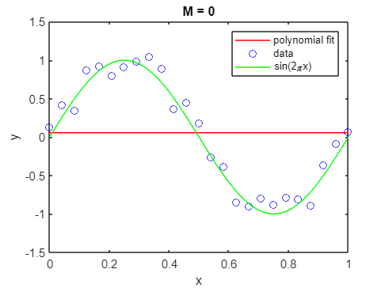
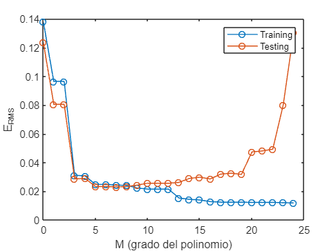

# Polynomial interpolation

Nel seguito di questo notebook verrà presentato un approccio alla base del ML: fitting polinomiale. Nello specifico verranno generati dei punti casualmente distribuiti attorno alla funzione seno e si otterà il polinomio interpolante (overfitting) che attraversa tutti i punti (di learning). In seguito si rappresenteranno polinomi aventi gradi inferiori a $n-1$ (dove $n$ rappresenta il numero di punti precedentemente generati) e si calcolerà lo scarto quadratico medio o root mean square error $E_{RMS}$ per ogni grado.

```matlab
% cleaning enviroment
clc
clear
```

Rappresento la funzione $y=sin(2\pi x)$ con $0\le x\le 1$

```matlab
% funzione seno
sen = @(x) sin(2*pi*x);

% genero vettori
x = linspace(0,1,100);
y = sen(x);
```

```matlab
% setto spessore linea
lw = 1;

% plotto funzione seno
figure;
plot(x,y,"LineWidth",lw)
xlabel("x")
ylabel("y")
legend("y = sin(2\pix)")
xlim([0 1])
ylim([-1.5 1.5])
```


Genero set di learning avente `n_lrn` punti randomicamente distribuiti attorno alla funzione seno

```matlab
% genero set di learning
n_lrn = 25;
x_lrn = linspace(0,1,n_lrn);
% rumore
eps = 0.2; 
y_lrn = sen(x_lrn) + rand_between(-eps,eps,n_lrn)';
```

```matlab
% rappresento punti
figure;
plot(x,y,"LineWidth",lw)
hold on
plot(x_lrn,y_lrn,"o","LineWidth",1)
legend("y = sin(2\pix)","data")
xlabel("x")
ylabel("y")
hold off
xlim([0 1])
ylim([-1.5 1.5])
```


## Riferimenti
Il **polinomio interpolante** è quel polinomio la cui curva passa attraverso tutti i punti sperimentali. Se il polinomio ha forma generale $y=a_1 +a_2 x+a_3 x^3 +...+a_n x^{n-1}$ dove 

   -  $n$ è il numero di punti da fittare; 
   -  $a_1$, $a_2$, ..., $a_n$ sono gli $n$ coefficienti del polinomio; 

Posto $\bar{x} =(x_1 ,x_2 ,...,x_n )$, affinchè il polinomio attraversi tutti i punti del vettore $\bar{x}$ deve verificare le seguenti condizioni:

$$
\begin{cases}
    y_1 =a_1 +a_2 x_1 +a_3 x_1^3 +...+a_n x_1^{n-1} \\
    y_2 =a_1 +a_2 x_2 +a_3 x_2^3 +...+a_n x_2^{n-1} \\
    ... \\
    y_n =a_1 +a_2 x_n +a_3 x_n^3 +...+a_n x_n^{n-1}
\end{cases}
$$

che è un sistema di $n$ equazioni in $n$ incognite. 
- La prima equazione rappresenta la condizione di passaggio per il punto $x_1$;
- La seconda equazione rappresenta la condizione di passaggio per il punto $x_2$;
- ...
- L' $n$-sima equazione rappresenta la condizione di passaggio per il punto $x_n$;

Il nostro obiettivo consiste nel risolvere il sistema per determinare gli $n$ coefficienti $a_1$, $a_2$, ..., $a_n$ e quindi il polinomio interpolante.

Sfruttando il formalismo matriciale è possibile rappresentare il sistema di $n$ equazioni come di seguito

$$
\left(\begin{array}{c}
y_1 \\
y_2 \\
...\\
y_n 
\end{array}\right)=\left(\begin{array}{ccccc}
1 & x_1  & x_1^2  & ... & x_1^{n-1} \\
1 & x_2  & x_2^2  & ... & x_2^{n-1} \\
... & ... & ... & ... & ...\\
1 & x_n  & x_n^2  & ... & x_n^{n-1} 
\end{array}\right)\cdot \left(\begin{array}{c}
a_1 \\
a_2 \\
...\\
a_n 
\end{array}\right)
$$

La matrice 

$$
V=\left(\begin{array}{ccccc}
1 & x_1  & x_1^2  & ... & x_1^{n-1} \\
1 & x_2  & x_2^2  & ... & x_2^{n-1} \\
... & ... & ... & ... & ...\\
1 & x_n  & x_n^2  & ... & x_n^{n-1} 
\end{array}\right)
$$

prende il nome "matrice di Vandermonde" e si genera elevando gli elementi del vettore $\bar{x}$  da 0 a $n-1$.

## Applicazioni
In MATLAB è possibile generare la matrice di Vandermonde utilizzando la funzione `vander()`

```matlab
% genero matrice di Vandermonde
V = fliplr(vander(x_lrn))
```

```text:Output
V = 25x25    
    1.0000         0         0         0         0         0         0         0         0         0         0         0         0         0         0         0         0         0         0         0         0         0         0         0         0
    1.0000    0.0417    0.0017    0.0001    0.0000    0.0000    0.0000    0.0000    0.0000    0.0000    0.0000    0.0000    0.0000    0.0000    0.0000    0.0000    0.0000    0.0000    0.0000    0.0000    0.0000    0.0000    0.0000    0.0000    0.0000
    1.0000    0.0833    0.0069    0.0006    0.0000    0.0000    0.0000    0.0000    0.0000    0.0000    0.0000    0.0000    0.0000    0.0000    0.0000    0.0000    0.0000    0.0000    0.0000    0.0000    0.0000    0.0000    0.0000    0.0000    0.0000
    1.0000    0.1250    0.0156    0.0020    0.0002    0.0000    0.0000    0.0000    0.0000    0.0000    0.0000    0.0000    0.0000    0.0000    0.0000    0.0000    0.0000    0.0000    0.0000    0.0000    0.0000    0.0000    0.0000    0.0000    0.0000
    1.0000    0.1667    0.0278    0.0046    0.0008    0.0001    0.0000    0.0000    0.0000    0.0000    0.0000    0.0000    0.0000    0.0000    0.0000    0.0000    0.0000    0.0000    0.0000    0.0000    0.0000    0.0000    0.0000    0.0000    0.0000
    1.0000    0.2083    0.0434    0.0090    0.0019    0.0004    0.0001    0.0000    0.0000    0.0000    0.0000    0.0000    0.0000    0.0000    0.0000    0.0000    0.0000    0.0000    0.0000    0.0000    0.0000    0.0000    0.0000    0.0000    0.0000
    1.0000    0.2500    0.0625    0.0156    0.0039    0.0010    0.0002    0.0001    0.0000    0.0000    0.0000    0.0000    0.0000    0.0000    0.0000    0.0000    0.0000    0.0000    0.0000    0.0000    0.0000    0.0000    0.0000    0.0000    0.0000
    1.0000    0.2917    0.0851    0.0248    0.0072    0.0021    0.0006    0.0002    0.0001    0.0000    0.0000    0.0000    0.0000    0.0000    0.0000    0.0000    0.0000    0.0000    0.0000    0.0000    0.0000    0.0000    0.0000    0.0000    0.0000
    1.0000    0.3333    0.1111    0.0370    0.0123    0.0041    0.0014    0.0005    0.0002    0.0001    0.0000    0.0000    0.0000    0.0000    0.0000    0.0000    0.0000    0.0000    0.0000    0.0000    0.0000    0.0000    0.0000    0.0000    0.0000
    1.0000    0.3750    0.1406    0.0527    0.0198    0.0074    0.0028    0.0010    0.0004    0.0001    0.0001    0.0000    0.0000    0.0000    0.0000    0.0000    0.0000    0.0000    0.0000    0.0000    0.0000    0.0000    0.0000    0.0000    0.0000

```

Alla luce della forma matriciale, è possibile determinare i coefficienti $a_1$, $a_2$, ..., $a_n$ (e quindi risolvere il sistema) eseguendo il prodotto righe per colonna tra l'inversa della matrice di Vandermonde $V^{-1}$ e il vettore colonna $\bar{y} =(y_1 ,y_2 ,...,y_n )$.

In  MATLAB è possibile eseguire questa operazione in due modi:
- utilizzando la sintassi `V\y_lrn'`;
- sfruttando la funzione `pinv()` che calcola la matrice pseudoinversa.

Il primo metodo sembra avere qualche problema quando la matrice di Vandermonde è molto grande quindi procediamo con la funzione `pinv()`

```matlab
a = pinv(V)*(y_lrn')
```

```text:Output
a = 25x1    
1.0e+11 *

    0.0000
    0.0000
   -0.0000
    0.0000
   -0.0005
    0.0057
   -0.0440
    0.2420
   -0.9646
    2.7869

```

Una volta determinati i coefficienti, è possibile ottenere il polinomio $y=a_1 +a_2 x+a_3 x^3 +...+a_n x^{n-1}$ che in MATLAB assume la seguente forma

```matlab
% ottengo il polinomio funzione degli scalari x e m (grado)
% poly = @(x,m) (x.^(0:m))*(a(1:m+1));
```

Calcoliamo e rappresentiamo quindi le ordinate previste dal polinomio completo (over-fitting)

```matlab
% definisco funzione poly_predict (vedi fine notebook)
% determino ordinate previste dal modello fornendo in input le ascisse x, i
% coefficienti a del polinomio, il grado m del polinomio
% poly_predict(x,a,m)

% plotting predicted values
figure;
plot(x,poly_predict(x,a,n_lrn-1),"r","LineWidth",lw)
hold on
plot(x_lrn,y_lrn,'ob',"LineWidth",1)
plot(x,y,"g","LineWidth",lw)
hold off
legend("polynomial fit", "data", "sin(2\pix)")
xlabel("x")
ylabel("y")
ylim([-1.5 1.5])
xlim([0 1])
title("over-fitting: m = n-1")
```


Cosa succede utilizzando polinomi di grado inferiore a $n-1$?

Per ottenere il polinomio arrestato a gradi $m < n-1$, è necessario determinare i coefficienti $\bar{a}$ considerando la matrice di Vandermonde $V$ avente $m+1$ colonne (non completa). Avendo determinato precedentemente la matrice di Vandermonde, ci limitiamo a selezionare tutte le righe e $m+1$ colonne utilizzando la sintassi MATLAB `V(:,1:m+1)`

```matlab
for m = 0:3
    
    % display Vandermonde matrix
    V(:,1:m+1)

    % determino coefficienti
    a = pinv(V(:,1:m+1))*(y_lrn')
    
    % plotting
    figure;
    plot(x,poly_predict(x,a,m),"r")
    hold on
    plot(x_lrn,y_lrn,'ob')
    plot(x,y,"g")
    hold off
    legend("polynomial fit", "data", "sin(2\pix)")
    xlabel("x")
    ylabel("y")
    ylim([-1.5 1.5])
    xlim([0 1])
    title(sprintf("M = %d",m))
end
```

```text:Output
V = 25x1    
     1
     1
     1
     1
     1
     1
     1
     1
     1
     1

a = 0.0559
```



```text:Output
V = 25x2    
    1.0000         0
    1.0000    0.0417
    1.0000    0.0833
    1.0000    0.1250
    1.0000    0.1667
    1.0000    0.2083
    1.0000    0.2500
    1.0000    0.2917
    1.0000    0.3333
    1.0000    0.3750

a = 2x1    
    0.8776
   -1.6433

```


```text:Output
V = 25x3    
    1.0000         0         0
    1.0000    0.0417    0.0017
    1.0000    0.0833    0.0069
    1.0000    0.1250    0.0156
    1.0000    0.1667    0.0278
    1.0000    0.2083    0.0434
    1.0000    0.2500    0.0625
    1.0000    0.2917    0.0851
    1.0000    0.3333    0.1111
    1.0000    0.3750    0.1406

a = 3x1    
    0.8961
   -1.7595
    0.1162

```


```text:Output
V = 25x4    
    1.0000         0         0         0
    1.0000    0.0417    0.0017    0.0001
    1.0000    0.0833    0.0069    0.0006
    1.0000    0.1250    0.0156    0.0020
    1.0000    0.1667    0.0278    0.0046
    1.0000    0.2083    0.0434    0.0090
    1.0000    0.2500    0.0625    0.0156
    1.0000    0.2917    0.0851    0.0248
    1.0000    0.3333    0.1111    0.0370
    1.0000    0.3750    0.1406    0.0527

a = 4x1    
   -0.0533
   10.9476
  -32.3084
   21.6164

```


## Errore di learning e testing

Per questa occasione utilizzeremo il root mean square error (o scarto quadratico medio)

$$
E_{RMS} =\frac{1}{n}\sum_i^n (P_i -O_i )^2
$$

dove

   -  $n$ rappresenta il numero di punti; 
   -  $P_i$ il valore previsto; 
   -  $O_i$ il valore osservato 

Essendo interessati all'andamento di $E_{RMS}$ in funzione del grado $m$ del polinomio, calcoleremo l'errore $n$ volte in quanto $0\leq m \leq n-1$.

Prima di procedere al calcolo dell'errore di testing (`testing_error`) è necessario generare un apposito set di testing $(x_{tst}, y_{tst})$ e stimare le ordinate y_fit_tst sulla base del modello di learning

```matlab
% genero set di testing
n_tst = 30;
x_tst = linspace(0,1,n_tst);
y_tst = sen(x_tst) + rand_between(-eps,eps,n_tst)';
```

```matlab
% rappresento learning set e testing set
plot(x,y,"LineWidth",lw)
hold on
plot(x_lrn,y_lrn,'o',"LineWidth",1)
plot(x_tst,y_tst,'o',"LineWidth",1)
hold off
xlabel("x")
ylabel("y")
ylim([-1.5 1.5])
xlim([0 1])
legend("y=sin(2\pix)","Learnings set","Test set")
title(sprintf("Learning set (%d points) and testing set (%d)",n_lrn,n_tst))
```


```matlab
% initializing error vectors
learning_error = zeros(1,n_lrn);
testing_error = zeros(1,n_lrn);
y_fit_lrn = zeros(1,n_lrn);
y_fit_tst = zeros(1,n_tst);

for j = 1:n_lrn
    m = j-1;
    a = pinv(V(:,1:j))*(y_lrn');
    y_fit_lrn = poly_predict(x_lrn,a,m);
    y_fit_tst = poly_predict(x_tst,a,m);

    % calculating learning error
    learning_error(j) = sqrt(sum((y_fit_lrn-y_lrn).^2))/n_lrn;

    % calculating testing error
    testing_error(j) = sqrt(sum((y_fit_tst-y_tst).^2))/n_tst;
end

% plotting 
plot(0:n_lrn-1,learning_error,"-o","LineWidth",lw)
hold on
plot(0:n_lrn-1,testing_error,"-o","LineWidth",lw)
hold off
xlabel("M (grado del polinomio)")
ylabel("E_{RMS}")
legend("Training")
legend("Training","Testing")
```



## Funzioni

```matlab
% randbet
% a: estremo inferiore
% b: estremo superiore
% n: numero di elementi da generare
% output: vettore
function randbet = rand_between(a,b,n)
    randbet = a + (b-a).*rand(n,1);
end

% custom_vander
% x: vettore a partire da cui calcolare la matrice di Vandermonde arrestata
% m: grado del polinomio personalizzato
function [output_matrix] = custom_vander(x,m)
    output_matrix = zeros(1, m+1);
    for i=1:length(x)
        output_matrix(i,:) = x(i).^(0:1:m);
    end
end

% poly_predict
% descrizione: permette di ottenere le ordinate dati i parametri seguenti
% x: vettore (ordinate)
% a: vettore (coefficienti del polinomio)
% m: scalare (grado del polinomio)
function output_vector = poly_predict(x,a,m)
    poly = @(x,m) (x.^(0:m))*(a(1:m+1));
    lx = length(x);
    output_vector = zeros(1,lx);
    for i=1:lx
        output_vector(i) = poly(x(i),m);
    end
end
```
