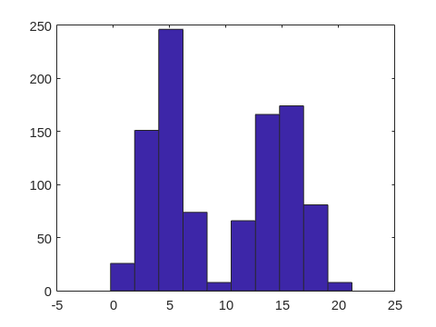

# Principal Component Analysis (PCA)

Lorem Ipsum

```matlab
clc
clear
close all
```

Genero distribuzione normale di $n$ punti random con deviazione standard $\sigma$ e media $\mu$

```matlab
n = 500;                % numero di punti
sigma = 2;              % deviazione standard
mu = 15;                % media

% genero primo set di dati (l = 0)
data = sigma.*randn(n,2) + mu;
l = repelem(0,n,1);

% concateno secondo set di dati (l = 1)
data = [data; (sigma*0.8).*randn(n,2) + mu*0.3];
l = [l; repelem(1,n,1)];
x = data(:,1);
y = data(:,2);

% rappresento dati
hist(x)
```


```matlab
hist(y)
```


```matlab

plot(x,y,'o')
xlim([floor(min(x))-1 ceil(max(x))]+1)
ylim([floor(min(y))-1 ceil(max(y))]+1)
```


Per filtrare le x e le y appartenenti alla prima distribuzione mi basta usare la sintassi `x(l==0)` e `y(l==0)` che sta per "prendimi le righe che rispettano la condizione `l==0`". Procedo quindi a rappresentare queste due distribuzioni

```matlab
% rappresento la prima distribuzione
plot(x(l==0),y(l==0),'o')
hold on
% rappresento la seconda distribuzione
plot(x(l==1),y(l==1),'o')
hold off
xlim([floor(min(x))-1 ceil(max(x))]+1)
ylim([floor(min(y))-1 ceil(max(y))]+1)
grid on
legend("$l = 0$","$l = 1$",'Interpreter','latex')
xlabel("$x$",'Interpreter','latex')
ylabel("$y$",'Interpreter','latex')
```

<<<<<<< HEAD

=======

>>>>>>> 6122cfcec91bf6f4e514788cecdabaad3f012fbf

```matlab
% calcolo media
xm = mean(x);
ym = mean(y);

% centro i dati
xc = x-xm;
yc = y-ym;
```

```matlab
% plotto distribuzione centrata
plot(xc(l==0),yc(l==0),'o')
<<<<<<< HEAD
=======
```

```matlab:Code
>>>>>>> 6122cfcec91bf6f4e514788cecdabaad3f012fbf
hold on
plot(xc(l==1),yc(l==1),'o')
hold off
xlim([floor(min(xc))-1 ceil(max(xc))]+1)
ylim([floor(min(yc))-1 ceil(max(yc))]+1)
grid on
legend("$l = 0$","$l = 1$",'Interpreter','latex')
xlabel("$x$",'Interpreter','latex')
ylabel("$y$",'Interpreter','latex')
title("Distribuzioni centrate nell'origine")
```


```matlab
% esporto in md
livescript2markdown("pca.mlx","../README.md","AddMention",true)
```

```text:Output
Error using livescript2markdown
Invalid argument at position 1. The following files do not exist: 'pca.mlx'.
```

***
*Generated from pca.mlx with [Live Script to Markdown Converter](https://github.com/roslovets/Live-Script-to-Markdown-Converter)*
