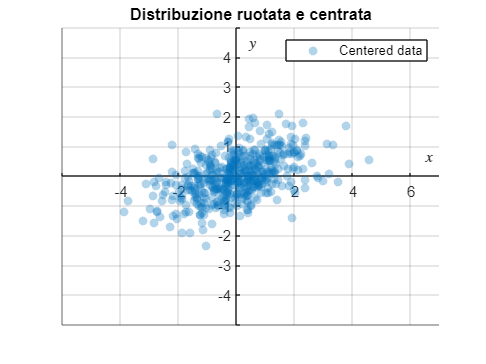
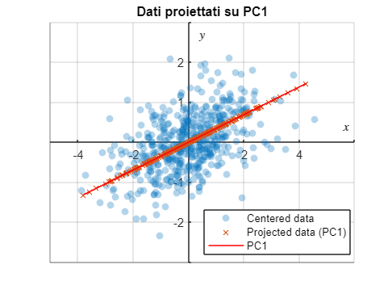

# Principal Component Analysis (PCA)

Lorem Ipsum

```matlab:Code
clc
clear
close all
```

# Building dataset

Genero distribuzione normale di $n$ punti random con deviazione standard $\sigma$ e media $\mu$. 

In `MATLAB` è possibile generare delle distribuzioni normali utilizzando la funzione `randn();` tale funzione restituisce una distribuzione centrata sullo zero ($\mu =0$) e deviazione standard unitaria ($\sigma =1$). Qualora si volessero modificare tali parametri sarà sufficiente moltiplicare l'output per la $\sigma$ voluta e aggiungere $\mu$ al risultato del prodotto. La sintassi sarà quindi del tipo \texttt{data = sigma.*randn(n,2) + mu.} Si noti che il numero `2` come argomento della funzione `randn()` indica il numero di colonne da generare: una per le ascisse $x$, una per le ordinate $y$.

Nel caso in cui si volesse specificare una deviazione standard differente per le $x$ e per le $y$ per modificare la forma della distribuzione, è possibile porre $\sigma =(\sigma_x ,\sigma_y )$.

In tal modo, se $P$ è la matrice output della funzione `randn()` 

$$
P=\left(\begin{array}{cc}
x_1  & y_1 \\
x_2  & y_2 \\
... & ...\\
x_n  & y_n 
\end{array}\right)
$$

sarà sufficiente effettuare moltiplicazione elemen-wise (prodotto di Hadamard) $\sigma \odot P$ per modificare la deviazione standard della distribuzione:

$$
\sigma \odot P=\left(\begin{array}{cc}
\sigma_x \left(\begin{array}{c}
x_1 \\
x_2 \\
...\\
x_n 
\end{array}\right) & \sigma_y \left(\begin{array}{c}
y_1 \\
y_2 \\
...\\
y_n 
\end{array}\right)
\end{array}\right)
$$

In `MATLAB` la sintassi da utilizzare è \texttt{sigma.*randn(n,2)} dove `sigma = [2 0.9]` con $\sigma_x =2$, $\sigma_y =0.9$.

```matlab:Code
n = 500;                % numero di punti
sigma = [2 0.9];        % deviazione standard su x e su y
mu = 15;                % media

% genero primo set di dati (l = 0)
data = sigma.*randn(n,2) + mu;
l = repelem(0,n,1);

% concateno secondo set di dati (l = 1)
data = [data; (sigma*0.8).*randn(n,2) + mu*0.3];
l = [l; repelem(1,n,1)];
x = data(:,1);
y = data(:,2);

% rappresento dati
% hist(x)
% hist(y)

plot(x,y,'o')
xlim([floor(min(x))-1 ceil(max(x))]+1)
ylim([floor(min(y))-1 ceil(max(y))]+1)
```


Per filtrare le x e le y appartenenti alla prima distribuzione mi basta usare la sintassi `x(l==0)` e `y(l==0)` che sta per "prendimi le righe che rispettano la condizione `l==0`". Procedo quindi a rappresentare queste due distribuzioni

```matlab:Code
% rappresento la prima distribuzione
plot(x(l==0),y(l==0),'o')
hold on
% rappresento la seconda distribuzione
plot(x(l==1),y(l==1),'o')
hold off
xlim([floor(min(x))-1 ceil(max(x))]+1)
ylim([floor(min(y))-1 ceil(max(y))]+1)
grid on
legend("$l = 0$","$l = 1$",'Interpreter','latex','Location','best')
xlabel("$x$",'Interpreter','latex')
ylabel("$y$",'Interpreter','latex')
```


Adesso applichiamo una **trasformazione lineare** alle distribuzioni dei dati. Se la matrice della trasformazione $T$ è

$$
T=\left(\begin{array}{cc}
1 & 1\\
-1 & 1
\end{array}\right)
$$

e il dataset contiene gli $n$ punti $P$

$$
P=\left(\begin{array}{cc}
x_1  & y_1 \\
x_2  & y_2 \\
... & ...\\
x_n  & y_n 
\end{array}\right)
$$

allora i punti trasformati $P^{\prime }$ si otterranno eseguendo il prodotto matriciale $TP^T$ dove $P^T$ indica la trasposta di $P$

$$
P^{\prime } =TP^T =\left(\begin{array}{cc}
1 & 1\\
-1 & 1
\end{array}\right)\left(\begin{array}{cccc}
x_1  & x_2  & ... & x_n \\
y_1  & y_2  & ... & y_n 
\end{array}\right)
$$

```matlab:Code
% creo matrice trasformazione
linear_trasformation = [1 1; -1 1]
```

```text:Output
linear_trasformation = 2x2    
     1     1
    -1     1

```

```matlab:Code

% applico trasformazione
transformed_data = (linear_trasformation*(data'))'
```

```text:Output
transformed_data = 1000x2    
   32.8385   -2.3840
   30.2483   -3.6875
   26.6734    1.6790
   30.4866    1.2056
   26.9441   -0.0823
   31.7398    0.8069
   33.7670   -4.6384
   28.7217    2.2283
   32.8389   -4.9562
   29.7488    1.6099

```

```matlab:Code

x = transformed_data(:,1);
y = transformed_data(:,2);

% estremi
endpoints = [floor(min(x))-1 floor(min(y))-1; ceil(max(x))+1 ceil(max(y))+1];
endpoints = array2table(endpoints,"VariableNames",{'x','y'})
```

| |x|y|
|:--:|:--:|:--:|
|1|1|-9|
|2|38|8|

```matlab:Code

% rappresento distribuzioni ruotate
plot(x(l==0),y(l==0),'o')
hold on
plot(x(l==1),y(l==1),'o')
hold off
% xlim([floor(min(x))-1 ceil(max(x))+1])
% ylim([floor(min(y))-1 ceil(max(y))+1])
xlim([endpoints.x(1) endpoints.x(2)])
ylim([endpoints.y(1) endpoints.y(2)])
grid on
legend("$l = 0$","$l = 1$",'Interpreter','latex')
xlabel("$x$",'Interpreter','latex')
ylabel("$y$",'Interpreter','latex')
title("Distribuzioni ruotate")
```



# Centering data

per centrare bla bla

```matlab:Code
% calcolo media
xm = mean(x);
ym = mean(y);

% centro i dati
xc = x-xm;
yc = y-ym;

% aggiorno estremi intervalli
endpoints = [floor(min(xc))-1 floor(min(yc))-1; ceil(max(xc))+1 ceil(max(yc))+1];
endpoints = array2table(endpoints,"VariableNames",{'x','y'})
```

| |x|y|
|:--:|:--:|:--:|
|1|-18|-9|
|2|18|8|

```matlab:Code
% plotto distribuzione centrata
plot(xc(l==0),yc(l==0),'o')
hold on
plot(xc(l==1),yc(l==1),'o')
% aggiungo assi
plot(linspace(endpoints.x(1),endpoints.x(2),2),repelem(0,2),"Color","black")
plot(repelem(0,2), linspace(endpoints.y(1),endpoints.y(2),2),"Color","black")
hold off
xlim([endpoints.x(1) endpoints.x(2)])
ylim([endpoints.y(1) endpoints.y(2)])
grid on
legend("$l = 0$","$l = 1$",'Interpreter','latex','Location','best')
xlabel("$x$",'Interpreter','latex')
ylabel("$y$",'Interpreter','latex')
title("Distribuzioni centrate nell'origine")
```



# Note

Questo documento è stato generato convertendo in markdown un `MATLAB` livescript utilizzano il tool `livescript2markdown`

```matlab:Code
% esporto in md
livescript2markdown("pca.mlx","../README.md","AddMention",true,"Format","github")
```

```text:Output
Coverting latex to markdown is complete
README.md
Note: Related images are saved in README_images
ans = "C:\Users\Dennis Angemi\Documents\GitHub\machine-learning-for-physics\2_principal_component_analysis\README.md"
```

***
*Generated from pca.mlx with [Live Script to Markdown Converter](https://github.com/roslovets/Live-Script-to-Markdown-Converter)*
