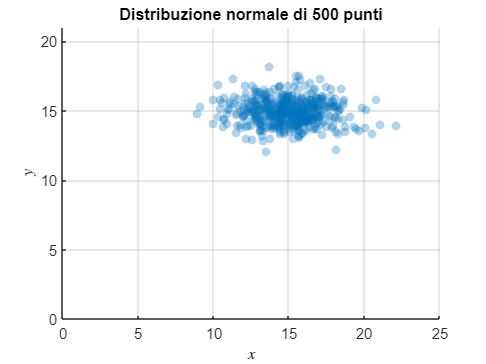

# Principal Component Analysis (PCA)

Lorem Ipsum

⚠️ Work in progress 

```matlab
clc
clear
close all
```

# Building dataset

Genero distribuzione normale di $n$ punti random con deviazione standard $\sigma$ e media $\mu$. 

In `MATLAB` è possibile generare delle distribuzioni normali utilizzando la funzione `randn();` tale funzione restituisce una distribuzione centrata sullo zero ($\mu =0$) e deviazione standard unitaria ($\sigma =1$). Qualora si volessero modificare tali parametri sarà sufficiente moltiplicare l'output per la $\sigma$ voluta e aggiungere $\mu$ al risultato del prodotto. La sintassi sarà quindi del tipo \texttt{data = sigma.*randn(n,2) + mu}. Si noti che il numero `2` come argomento della funzione `randn()` indica il numero di colonne da generare: una per le ascisse $x$, una per le ordinate $y$.

Nel caso in cui si volesse specificare una deviazione standard differente per le $x$ e per le $y$ per modificare la forma della distribuzione, è possibile porre $\sigma =(\sigma_x ,\sigma_y )$.

In tal modo, se $P$ è la matrice output della funzione `randn()` 

$$
P=\left(\begin{array}{cc}
x_1  & y_1 \\
x_2  & y_2 \\
... & ...\\
x_n  & y_n 
\end{array}\right)
$$

sarà sufficiente effettuare moltiplicazione elemen-wise (prodotto di Hadamard) $\sigma \odot P$ per modificare la deviazione standard della distribuzione:

$$
\sigma \odot P=\left(\begin{array}{cc}
\sigma_x  & \sigma_y 
\end{array}\right)\odot \left(\begin{array}{cc}
x_1  & y_1 \\
x_2  & y_2 \\
... & ...\\
x_n  & y_n 
\end{array}\right)=\left(\begin{array}{cc}
\sigma_x x_1  & \sigma_y y_1 \\
\sigma_x x_2  & \sigma_y y_2 \\
... & ...\\
\sigma_x x_n  & \sigma_y y_n 
\end{array}\right)
$$

In `MATLAB` la sintassi da utilizzare è \texttt{sigma.*randn(n,2)} dove `sigma = [2 0.9]` con $\sigma_x =2$, $\sigma_y =0.9$.

```matlab
n = 500;                % numero di punti
sigma = [2 0.9];        % deviazione standard su x e su y
mu = 15;                % media

% genero set di dati
data = sigma.*randn(n,2) + mu;

x = data(:,1);
y = data(:,2);

endpoints = find_endpoints(data,2);     % limiti degli assi
alpha = .3;                             % opacità dei punti

% rappresento distribuzione
figure;
scatter(x,y,'o','filled','MarkerEdgeColor','none','MarkerFaceAlpha',alpha)
xlim([0 endpoints(2)])
ylim([0 endpoints(4)])
xlabel("$x$",'Interpreter','latex')
ylabel("$y$",'Interpreter','latex')
title(sprintf("Distribuzione normale di %d punti",n))
grid on
box off
ax = gca;
ax.XAxisLocation = 'origin';
ax.YAxisLocation = 'origin';
```



Adesso applichiamo una **trasformazione lineare** alle distribuzioni dei dati. Se la matrice della trasformazione $T$ è

$$
T=\left(\begin{array}{cc}
1 & 1\\
-1 & 1
\end{array}\right)
$$

e il dataset contiene gli $n$ punti $P$

$$
P=\left(\begin{array}{cc}
x_1  & y_1 \\
x_2  & y_2 \\
... & ...\\
x_n  & y_n 
\end{array}\right)
$$

allora i punti trasformati $P^{\prime }$ si otterranno eseguendo il prodotto matriciale $TP^T$ dove $P^T$ indica la trasposta di $P$

$$
P^{\prime } =TP^T =\left(\begin{array}{cc}
1 & 1\\
-1 & 1
\end{array}\right)\left(\begin{array}{cccc}
x_1  & x_2  & ... & x_n \\
y_1  & y_2  & ... & y_n 
\end{array}\right)
$$

```matlab
% creo matrice trasformazione
% linear_trasformation = [1 1; -1 1]
linear_trasformation = rand(2,2)
```

```text:Output
linear_trasformation = 2x2    
    0.1336    0.7411
    0.0166    0.1898

```

```matlab

% applico trasformazione
transformed_data = (linear_trasformation*(data'))'
```

```text:Output
transformed_data = 500x2    
   12.2076    2.8771
   12.7623    3.0243
   13.1453    3.1193
   11.7652    2.7515
   13.2342    3.1068
   11.7873    2.7696
   11.5075    2.6944
   12.0457    2.8336
   13.1519    3.1240
   13.5176    3.1823

```

```matlab

x = transformed_data(:,1);
y = transformed_data(:,2);

endpoints = find_endpoints(transformed_data,2);     % limiti degli assi

% rappresento distribuzione ruotata
scatter(x,y,'o','filled','MarkerEdgeColor','none','MarkerFaceAlpha',alpha)
xlim([0 endpoints(2)])
ylim([endpoints(3) endpoints(4)])
xlabel("$x$",'Interpreter','latex')
ylabel("$y$",'Interpreter','latex')
grid on
ax = gca;
ax.XAxisLocation = 'origin';
ax.YAxisLocation = 'origin';
title("Distribuzione ruotata")
```


# Centering data

```matlab
% centro i dati sottraendo la media
dfm = mean(transformed_data)
```

```text:Output
dfm = 1x2    
   13.0849    3.0871

```

```matlab
B = transformed_data-dfm
```

```text:Output
B = 500x2    
   -0.8774   -0.2100
   -0.3227   -0.0628
    0.0603    0.0322
   -1.3198   -0.3356
    0.1493    0.0197
   -1.2977   -0.3175
   -1.5774   -0.3926
   -1.0392   -0.2535
    0.0670    0.0370
    0.4326    0.0952

```

```matlab

% rappresento distribuzioni centrate
scatter(B(:,1),B(:,2), 'filled', 'MarkerFaceAlpha', alpha,'MarkerEdgeColor','none')
title("Distribuzione ruotata e centrata")
xlabel("$x$",'Interpreter','latex')
ylabel("$y$",'Interpreter','latex')
legend("Centered data")
axis(find_endpoints(B,2))
box off
grid on
ax = gca;
ax.XAxisLocation = 'origin';
ax.YAxisLocation = 'origin';
```


# Riferimenti matematici

I *Principal components* sono degli assi su cui è possibile proiettare i dati massimizzando la varianza. Tali assi sono definiti come gli autovettori della matrice di covarianza $\Sigma$

$$
\Sigma =\left(\begin{array}{cc}
var(\bar{x} ) & cov(\bar{x} ,\bar{y} )\\
cov(\bar{y} ,\bar{x} ) & var(\bar{y} )
\end{array}\right)
$$

Si noti che la diagonale della matrice $\Sigma$ contiene le varianze $\sigma_i$ che in `MATLAB` è possibile estrarre utilizzando la funzione `diag()`.

Per quanto riguarda gli autovettori e gli autovalori, questi possono essere determinati utilizzando la sintassi `[autovettori, autovalori] = eig(C)` dove `C` è la matrice di covarianza. Noi saremo interessati all'autovalore massimo (che sarà utile per PC1).

```matlab
C = cov(B)
```

```text:Output
C = 2x2    
    0.5352    0.1280
    0.1280    0.0317

```

```matlab
[evec,eval]=eig(C)
```

```text:Output
evec = 2x2    
    0.2331   -0.9725
   -0.9725   -0.2331

eval = 2x2    
    0.0010         0
         0    0.5659

```

```matlab
[emax,id_emax]= max(diag(eval));
[emin,id_emin]= min(diag(eval));

% la posizione dell'autovettore massimo sarà utile per estrarre la colonna
% degli autovettori pari a id_emax
PC1 = evec(:,id_emax)
```

```text:Output
PC1 = 2x1    
   -0.9725
   -0.2331

```

```matlab
PC2 = evec(:,id_emin)
```

```text:Output
PC2 = 2x1    
    0.2331
   -0.9725

```

```matlab

% proiettiamo i dati B su PC1 eseguendo il prodotto scalare
z = B*PC1
```

```text:Output
z = 500x1    
    0.9022
    0.3284
   -0.0662
    1.3616
   -0.1497
    1.3359
    1.6255
    1.0697
   -0.0738
   -0.4429

```

```matlab

% otteniamo coordinate
projected_B = z*PC1'
```

```text:Output
projected_B = 500x2    
   -0.8773   -0.2103
   -0.3194   -0.0765
    0.0643    0.0154
   -1.3241   -0.3173
    0.1456    0.0349
   -1.2992   -0.3113
   -1.5807   -0.3788
   -1.0403   -0.2493
    0.0717    0.0172
    0.4307    0.1032

```

```matlab
p_b_2 = (B*PC2)*PC2';
```

```matlab
% rappresento i dati
scatter(B(:,1),B(:,2), 'filled', 'MarkerFaceAlpha', alpha,'MarkerEdgeColor','none')
hold on
scatter(projected_B(:,1),projected_B(:,2), 'filled', 'MarkerFaceAlpha', alpha,'MarkerEdgeColor','none')
plot(projected_B(:,1),projected_B(:,2),'r-','LineWidth',1)
plot(p_b_2(:,1),p_b_2(:,2),'g-','LineWidth',1)
hold off
grid on
legend("Centered data","Projected data (PC1)","PC1","PC2",'Location','best')
axis(find_endpoints(projected_B,.4))
xlabel("$x$",'Interpreter','latex')
ylabel("$y$",'Interpreter','latex')
title("Dati proiettati su PC1")
ax = gca;
ax.XAxisLocation = 'origin';
ax.YAxisLocation = 'origin';
```


# SVD

come fare tutto con SVD?

# Note

Questo documento è stato generato convertendo in markdown un `MATLAB` livescript utilizzano il tool `livescript2markdown`

```matlab
% esporto in md
livescript2markdown("pca_v2.mlx","../README.md","AddMention",true,"Format","github")
```

```text:Output
Coverting latex to markdown is complete
README.md
Note: Related images are saved in README_images
ans = "C:\Users\Dennis Angemi\Documents\GitHub\machine-learning-for-physics\2_principal_component_analysis\README.md"
```

# Functions

```matlab
function endpoints = find_endpoints(data_array,margin)
    endpoints = [floor(min(data_array(:,1)))-margin ceil(max(data_array(:,1)))+margin floor(min(data_array(:,2)))-margin ceil(max(data_array(:,2)))+margin];
end
```

***
*Generated from pca_v2.mlx with [Live Script to Markdown Converter](https://github.com/roslovets/Live-Script-to-Markdown-Converter)*
